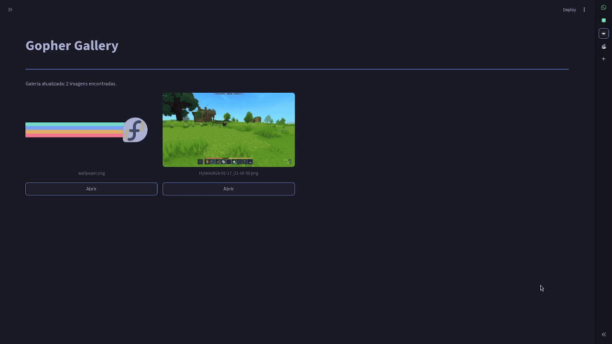

# Gopher gallery

Projeto feito em go para aprender a utilizar buckets do aws simulados por localstack
## Demonstração





## Configurar

Para compilar esse projeto, você vai precisar criar o arquivo `.env` com as seguintes informações:

```env
# Configurações AWS
AWS_REGION=us-east-1
AWS_ACCESS_KEY_ID=test
AWS_SECRET_ACCESS_KEY=test
AWS_ENDPOINT=http://localhost:4566
BUCKET_NAME=meu-bucket
```
com esse exemplo se pode rodar localmente pois o `docker-compose.yml`


## Rodando localmente

Baixe as seguintes dependências

na pasta front end:

```bash
 pip install streamlit requests   
```

e após isso rode para o back end:

```bash
  go mod tidy    
```

com isso tudo estará instalado para poder executar, rode o comando:
```bash
./scripts/start.sh  
``` 
na sua máquina linux afim de iniciar o container e o back end e por fim execute o comando para iniciar o front end:

``` bash
 streamlit ./front-end/main.py  
 ```